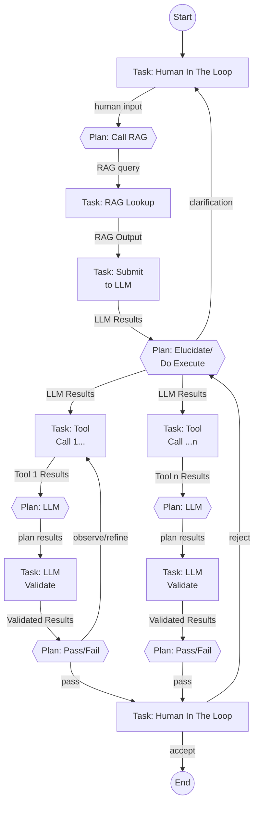

# Agentic Framework – High‑Level Overview

## Purpose & Vision

The framework allows developers to compose and execute **directed cyclic graphs of work items** ("AgentGraphs") for agentic workflows. Each node is a Task that emits an immutable state object; edges transport that state to the next node, enabling transparent **plan → act → observe → act** cycles that repeat until all graph edges are resolved, all while retaining full provenance.

**Why?**

* **Multitenant Agent Runner** – runs agent graphs at scale with per-tenant Kafka topic isolation and PostgreSQL persistence.
* **Clean separation of concerns** – "Tasks" handles *doing*, "Plans" handles *deciding*, letting you mix deterministic rules with LLM‑powered reasoning without entangling the two.
* **Simple Graph Abstraction** - Logically, Task nodes output to Plan nodes, and Plan nodes output to Task nodes in alternating tick-tock execution.
* **Auditable** – every Task Execution and Plan Execution is an append‑only event persisted to PostgreSQL.
* **Protocol Buffers** – all inter-service messages are protobuf-serialized over Kafka; Python task/plan code runs in isolated subprocesses.

### Example AgentGraph - Coding Agent

This Coding Agent example Agent Graph illustrates **plan → act → observe** loops:

* A human describes an app, leading to iterative LLM summarisation and clarification cycles.
* The planner can spawn parallel code‑generation branches (`CodeLLM1 … CodeLLM N`), each with its own validation and human acceptance loop.
* Conditional edges (dashed in text) show how planners route either back for refinement or forward toward acceptance, embodying both depth‑first and breadth‑first flows within a single AgentGraph.

---

## Core Domain Model

| Entity            | Description                                                                                                                         |
|-------------------|-------------------------------------------------------------------------------------------------------------------------------------|
| **AgentGraph**    | Immutable graph template (nodes + edges).                                                                                           |
| **AgentLifetime** | One runtime instance of an AgentGraph executing to completion.                                                                      |
| **Task**          | Node type that performs work – API call, DB query, computation.                                                                     |
| **Plan**          | Node type that selects the next **Task**(s) based on rules or prior state.                                                          |
| **Edge**          | Directed link between a Task and a Plan (or vice versa). Edges enforce alternation: PLAN→TASK or TASK→PLAN only.                   |
| **TaskResult**    | Structured output from a Task. Protobuf schema supports inline data or external URI reference (currently inline only).              |
| **TaskExecution** | Append-only record of a single Task run; contains the **TaskResult**.                                                               |
| **PlanResult**    | Structured output from a Plan; contains `next_task_names[]` routing decision.                                                       |
| **PlanExecution** | Append-only record of a single Plan run; contains the **PlanResult**.                                                               |

---

## TaskExecution - Execution Record

A record emitted on every TaskExecution. Two sections:

1. **Headers** – identity (`exec_id`, `graph_id`, `lifetime_id`, `tenant_id`), timing (`created_at`), status, iteration, attempt count.
2. **TaskResult** – `{ oneof: { inline_data: Any | external_data: StoredData } }`. Currently all results are inlined; external blob storage is defined in the protobuf schema but not yet implemented at runtime.

---
## Logical Flow (Happy Path)

1. **Task** executes and produces some output as a **TaskResult**.
2. **TaskResult** is used as input to the downstream **Plan**.
3. **Plan** evaluates and produces a **PlanResult** listing `next_task_names[]`.
4. Downstream **Task** executes using the **PlanResult** as input and produces a **TaskResult**.

## Runtime Flow (Happy Path)

1. **Task** executes and produces a **TaskExecution** (containing a **TaskResult**).
   * The **TaskExecution** is published to the `task-executions-{tenantId}` Kafka topic.
2. **Data Plane** persists the **TaskExecution** in PostgreSQL (append‑only) and republishes the message to the `persisted-task-executions-{tenantId}` topic.
3. **Control Plane** reads the persisted execution, evaluates guardrails, and looks up the downstream Plan in the graph.
   * **Pass** → publishes a **PlanInput** to the `plan-inputs-{tenantId}` topic.
4. **Executor** consumes the **PlanInput**, executes the Plan Python code, produces a **PlanExecution** listing `next_task_names[]`, and publishes to the `plan-executions-{tenantId}` topic.
5. **Data Plane** persists the **PlanExecution** and republishes to the `persisted-plan-executions-{tenantId}` topic.
6. **Control Plane** reads the persisted PlanExecution, resolves next task names against the graph, and publishes **TaskInput** messages to the `task-inputs-{tenantId}` topic.
7. Steps 1-6 repeat following the graph path until all graph edges are resolved, completing the AgentLifetime.

---

## Current Architecture

The system consists of **3 core microservices** plus supporting services, all Java 21 / Spring Boot, communicating via Kafka with Protocol Buffers:

| Service | Port | Role |
|---------|------|------|
| **Data Plane** | 8081 | Persists execution records, forwards to control plane topics |
| **Control Plane** | 8082 | Evaluates guardrails, routes messages between executors based on graph topology |
| **Executor** | 8083 | Executes Python task/plan code via subprocess, publishes results |
| **Graph Composer** | 8088 | Web UI + REST API for graph management |
| **Graph Builder** | 8087 | Parses graph specifications (DOT format) |
| **Admin** | 8086 | Administrative functions |
| **Frontend** | 5173 | React/Vite UI for graph visualization |

### Kafka Topic Architecture (6 topic types, tenant-aware)

All topics follow pattern: `{message-type}-{tenantId}`

1. `task-executions-{tenantId}` – Executor publishes TaskExecution protobuf messages
2. `plan-executions-{tenantId}` – Executor publishes PlanExecution protobuf messages
3. `persisted-task-executions-{tenantId}` – Data Plane forwards to Control Plane
4. `persisted-plan-executions-{tenantId}` – Data Plane forwards to Control Plane
5. `plan-inputs-{tenantId}` – Control Plane publishes PlanInput for Executor
6. `task-inputs-{tenantId}` – Control Plane publishes TaskInput for Executor

---

## Guardrail Policies (Control Plane)

The control plane includes a **GuardrailEngine** that evaluates every execution before routing to the next node. The engine is currently a pass-through stub with the interface in place for future policy enforcement.

**Planned capabilities:**
* Declarative YAML policies (e.g., `sum(tokens_used) > 10,000 → abort_lifetime`)
* Per‑execution or cumulative per‑lifetime/tenant enforcement
* Actions on breach: `REJECT_EXECUTION`, `PAUSE_LIFETIME`, `ABORT_LIFETIME`

---

## Extensibility Points

* **Task/Plan Python Code** – implement `plan.py` with `plan(plan_input) -> PlanResult` or `task.py` with `task(task_input) -> TaskResult`
* **Graph Specification** – define graphs in GraphViz DOT format with `type="plan"` / `type="task"` attributes
* **Guardrail Engine** – pluggable policy evaluation (planned: YAML v1, Rego)
* **Language Ports** – interfaces are protobuf; additional language runtimes can be added alongside Python

---

## Non‑Functional Properties

* **Per-tenant isolation** – Kafka topics are scoped by tenant ID; routing and persistence are tenant-aware.
* **Append-only audit trail** – all executions are immutable records in PostgreSQL.
* **Manual Kafka acknowledgment** – messages are only acknowledged after successful persistence, providing at-least-once delivery.

---

## Roadmap

1. Implement guardrail engine with YAML policies + cost/token tracking.
2. Add policy telemetry fields (`tokens_used`, `cost_usd`, `latency_ms`) to execution records.
3. Implement blob store adapter (S3/GCS) for large TaskResult payloads.
4. Add edge type semantics (`NORMAL`, `PARALLEL`, `JOIN`, `FINAL`) for richer graph control flow.
5. Add deterministic replay capability.
6. Build Python SDK with typed Task/Plan base classes.
7. Pluggable adapter SPI for Event Bus, State DB, Blob Store, KV Store.
8. Local development profile (in-memory queue + SQLite).
9. Dead letter queue (DLQ) per tenant for failed messages.
10. gRPC interfaces for inter-service communication alongside REST.
11. Helm chart for Kubernetes deployment.
