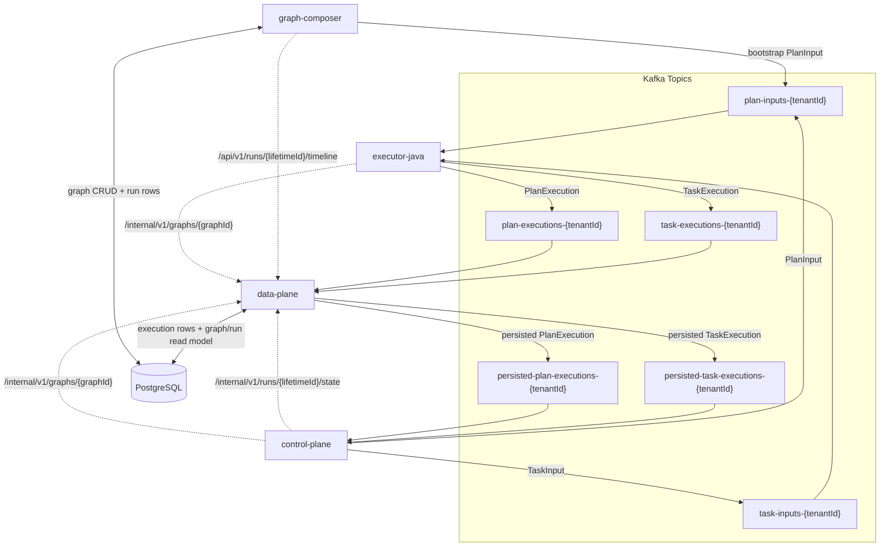
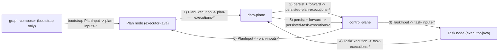

# Architecture and Data Flow (Current Runtime)

## Scope

This document describes the current code path for graph execution in this repository.

- Runtime model: Java services in Docker/Kubernetes.
- Message bus: Kafka with tenant-scoped topics.
- Persistence: PostgreSQL.
- Focus: control-plane and data-plane behavior, with executor-java and graph-composer interactions.

This is intended to match the current implementation, not historical or planned designs.

## Active Execution Services

The active end-to-end execution path uses these services:

1. `graph-composer`:
   - Graph CRUD API.
   - Stores graph definitions (plans/tasks/files/edges) and run records.
   - Publishes bootstrap `PlanInput` messages when execution starts.
2. `executor-java`:
   - Consumes `PlanInput`/`TaskInput`.
   - Resolves node source files via data-plane internal graph API.
   - Materializes python files locally and runs them through a Python runner.
   - Publishes `PlanExecution`/`TaskExecution`.
3. `data-plane`:
   - Consumes execution messages from executor-java.
   - Persists execution rows.
   - Maintains graph run lifecycle status transitions.
   - Republishes persisted executions for control-plane routing.
   - Serves internal graph/run lookup APIs.
4. `control-plane`:
   - Consumes persisted executions.
   - Verifies run state is routable.
   - Applies guardrail checks (current implementation is allow-by-default unless custom logic is added).
   - Resolves downstream nodes from canonical graph edges.
   - Publishes next `PlanInput`/`TaskInput`.

Supporting infrastructure:

- Kafka
- PostgreSQL

## Corrected Architecture Diagram

## Explicit Execution Loop Diagram

The repeated runtime loop while a run is `RUNNING` is:
`Plan node -> Data Plane -> Control Plane -> Task node -> Data Plane -> Control Plane -> next Plan node`.

## Kafka Topics and Keys

All execution topics are tenant-scoped with the pattern `{topic-prefix}-{tenantId}`.

Topic families:

1. `plan-inputs-{tenantId}`
2. `task-inputs-{tenantId}`
3. `plan-executions-{tenantId}`
4. `task-executions-{tenantId}`
5. `persisted-plan-executions-{tenantId}`
6. `persisted-task-executions-{tenantId}`

Keying strategy used in active producers:

- Key format: `{graph_id}:{node_name}`
- Implemented via `TopicNames.graphNodeKey(graphId, nodeName)`.

Producer/consumer mapping:

1. `graph-composer` and `control-plane` publish `PlanInput` to `plan-inputs-*`; `executor-java` consumes.
2. `control-plane` publishes `TaskInput` to `task-inputs-*`; `executor-java` consumes.
3. `executor-java` publishes `PlanExecution` to `plan-executions-*`; `data-plane` consumes.
4. `executor-java` publishes `TaskExecution` to `task-executions-*`; `data-plane` consumes.
5. `data-plane` publishes persisted `PlanExecution` to `persisted-plan-executions-*`; `control-plane` consumes.
6. `data-plane` publishes persisted `TaskExecution` to `persisted-task-executions-*`; `control-plane` consumes.

## Protobuf Contracts in Use

Current execution messages are defined in `protos/common.proto`:

1. `PlanInput`
2. `TaskInput`
3. `PlanExecution`
4. `TaskExecution`
5. `ExecutionHeader`

Context fields currently enforced in runtime:

1. `PlanInput.graph_id` is required.
2. `PlanInput.lifetime_id` is required.
3. `TaskInput.graph_id` is required.
4. `TaskInput.lifetime_id` is required.
5. `PlanExecution.header.graph_id` is required for downstream publish.
6. `PlanExecution.header.lifetime_id` is required for downstream publish.
7. `TaskExecution.header.graph_id` is required for downstream publish.
8. `TaskExecution.header.lifetime_id` is required for downstream publish.

Tenant routing behavior:

- Tenant is extracted from topic name in listeners.
- `ExecutionHeader.tenant_id` is populated by executor-java for execution outputs.

## Canonical Graph Model

Graph topology is modeled as canonical directed edges:

- `PLAN -> TASK`
- `TASK -> PLAN`

Persistence model:

- Table/entity: `graph_edges`
- Edge fields: `from_node_name`, `from_node_type`, `to_node_name`, `to_node_type`.

Graph lookup model returned by data-plane internal API includes:

1. `plans` with files
2. `tasks` with files
3. `edges` as canonical adjacency

No split `planToTasks` / `taskToPlan` maps are required by current routing logic.

## Graph and Run Lifecycle States

Graph lifecycle (`GraphStatus`):

1. `NEW`
2. `ACTIVE`
3. `ARCHIVED`

Allowed transitions:

1. `NEW -> ACTIVE | ARCHIVED`
2. `ACTIVE -> ARCHIVED`
3. Terminal: `ARCHIVED`

Run lifecycle (`GraphRunStatus`, keyed by `lifetime_id`):

1. `QUEUED`
2. `RUNNING`
3. `SUCCEEDED`
4. `FAILED`
5. `CANCELED`

Allowed transitions:

1. `QUEUED -> RUNNING | FAILED | CANCELED`
2. `RUNNING -> SUCCEEDED | FAILED | CANCELED`
3. Terminal: `SUCCEEDED | FAILED | CANCELED`

## End-to-End Execution Flow

### Explicit recurring loop

During normal execution, control and data flow repeats in this exact order:

1. Plan node executes in `executor-java`.
2. Plan execution goes to `data-plane` (persist + forward).
3. Persisted plan execution goes to `control-plane` (route).
4. Control-plane sends input to the next task node.
5. Task node executes in `executor-java`.
6. Task execution goes to `data-plane` (persist + forward).
7. Persisted task execution goes to `control-plane` (route).
8. Control-plane sends input to the next plan node.

This loop continues until the run reaches a terminal status (`SUCCEEDED`, `FAILED`, or `CANCELED`).

### 1) Bootstrap

1. Client calls `graph-composer` `POST /api/v1/graphs/{graphId}/execute?tenantId=...`.
2. `graph-composer`:
   - Validates graph.
   - Resolves entry plans from canonical edges.
   - Ensures graph status is `ACTIVE` (unless already active).
   - Inserts a `graph_runs` row with status `QUEUED`.
   - Publishes one bootstrap `PlanInput` per entry plan to `plan-inputs-*`.
   - Returns `ExecutionResponse.status = RUNNING` to caller while the run row starts as `QUEUED`.

### 2) Plan or task execution

1. `executor-java` consumes input message.
2. It fetches graph metadata/files from `data-plane` internal graph API.
3. It writes source files to a local working directory.
4. It runs the python script via the bundled runner using protobuf payloads.
5. It emits `PlanExecution` or `TaskExecution` to Kafka.

### 3) Persistence and forwarding

1. `data-plane` consumes execution message.
2. Persists execution rows (`plan_executions`, `task_executions`, `task_results` where applicable).
3. Applies run lifecycle update via `GraphRunLifecycleService`.
4. Publishes persisted execution message to `persisted-*` topics.

### 4) Routing

1. `control-plane` consumes persisted execution.
2. Validates required header context (`graph_id`, `lifetime_id`, node name).
3. Checks run state from data-plane (`/internal/v1/runs/{lifetimeId}/state`) and routes only when run status is `RUNNING`.
4. Applies guardrail evaluation.
5. Routes:
   - From successful `PlanExecution`: intersects requested `next_task_names` with graph-allowed downstream tasks from canonical edges, then publishes `TaskInput`.
   - From successful `TaskExecution`: resolves downstream plan(s) from canonical edges, then publishes `PlanInput`.

### 5) Completion/failure

1. Run transitions to `FAILED` when a failed execution is persisted.
2. Run transitions to `SUCCEEDED` when completion criteria are satisfied in `GraphRunLifecycleService`.
3. If execution events arrive before a run row exists, data-plane creates a placeholder run and continues lifecycle tracking.

## Data-Plane Internal APIs Used by Runtime

1. `GET /internal/v1/graphs/{graphId}?tenantId=...`
   - Used by control-plane and executor-java for graph resolution.
2. `GET /internal/v1/runs/{lifetimeId}/state?tenantId=...&graphId=...`
   - Used by control-plane to gate routing by run status.

## Observability APIs

Data-plane:

1. `GET /api/v1/runs/{lifetimeId}/timeline?tenantId=...&graphId=...`
   - Returns run status, counts, and ordered plan/task execution events.

Graph-composer:

1. `GET /api/v1/graphs/{graphId}/runs?tenantId=...`
2. `GET /api/v1/graphs/{graphId}/runs/{lifetimeId}/timeline?tenantId=...`
   - Proxies timeline retrieval through data-plane.

## Acknowledgment and Error Behavior (Current)

Kafka listeners are configured with manual acknowledgment (`MANUAL_IMMEDIATE`).

Current behavior in listeners:

1. Deserialization/tenant extraction failures are logged and acknowledged (message dropped).
2. Unexpected exceptions usually do not acknowledge, allowing retry by Kafka.
3. In data-plane execution listeners, if persistence returns `false`, the message is still acknowledged after logging failure.

This reflects current code behavior and should be considered when reasoning about delivery guarantees.

## Deployment Notes

Execution runtime is designed to run in containers. In this repository:

1. Services are wired through `docker-compose.yml`.
2. Makefile targets wrap docker/maven workflows for local execution.

For local end-to-end runs, use the containerized path rather than bare-metal service launches.

## Code Paths (Primary References)

1. `services/graph-composer/src/main/java/ai/eigloo/agentic/graphcomposer/service/GraphServiceImpl.java`
2. `services/graph-composer/src/main/java/ai/eigloo/agentic/graphcomposer/service/GraphExecutionBootstrapPublisher.java`
3. `services/executor-java/src/main/java/ai/eigloo/agentic/executorjava/kafka/PlanInputListener.java`
4. `services/executor-java/src/main/java/ai/eigloo/agentic/executorjava/kafka/TaskInputListener.java`
5. `services/executor-java/src/main/java/ai/eigloo/agentic/executorjava/service/ExecutorOrchestrationService.java`
6. `services/executor-java/src/main/java/ai/eigloo/agentic/executorjava/service/PythonProcessExecutor.java`
7. `services/data-plane/src/main/java/ai/eigloo/agentic/dataplane/kafka/PlanExecutionListener.java`
8. `services/data-plane/src/main/java/ai/eigloo/agentic/dataplane/kafka/TaskExecutionListener.java`
9. `services/data-plane/src/main/java/ai/eigloo/agentic/dataplane/service/PersistenceService.java`
10. `services/data-plane/src/main/java/ai/eigloo/agentic/dataplane/service/GraphRunLifecycleService.java`
11. `services/data-plane/src/main/java/ai/eigloo/agentic/dataplane/controller/InternalGraphController.java`
12. `services/control-plane/src/main/java/ai/eigloo/agentic/controlplane/kafka/ControlPlaneListener.java`
13. `services/control-plane/src/main/java/ai/eigloo/agentic/controlplane/service/ExecutionRouter.java`
14. `services/control-plane/src/main/java/ai/eigloo/agentic/controlplane/service/ExecutionStateGuardService.java`
15. `services/control-plane/src/main/java/ai/eigloo/agentic/controlplane/service/DataPlaneGraphClient.java`
16. `services/common-java/src/main/java/ai/eigloo/agentic/common/TopicNames.java`
17. `services/common-java/src/main/java/ai/eigloo/agentic/common/KafkaTopicPatterns.java`
18. `services/common-java/src/main/java/ai/eigloo/agentic/graph/entity/GraphStatus.java`
19. `services/common-java/src/main/java/ai/eigloo/agentic/graph/entity/GraphRunStatus.java`
20. `protos/common.proto`
