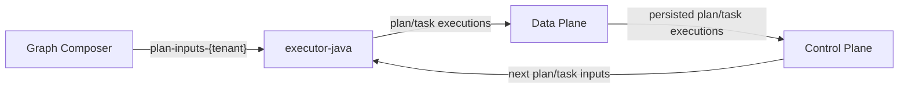

# Data Flow (Java Executor Architecture)

This document describes the current runtime architecture based on a single Java executor service (`executor-java`) that executes both plan and task nodes.

## Services

1. `graph-composer`
- Stores graph definitions and node source files in PostgreSQL.
- Starts runs by publishing entry `PlanInput` messages.

2. `control-plane`
- Consumes persisted executions.
- Applies guardrails and graph routing.
- Publishes downstream `PlanInput` and `TaskInput` messages.

3. `executor-java`
- Consumes `plan-inputs-{tenant}` and `task-inputs-{tenant}`.
- Resolves node code from PostgreSQL.
- Materializes files locally and runs Python.
- Publishes `PlanExecution` and `TaskExecution`.

4. `data-plane`
- Persists plan/task executions and task results.
- Tracks run lifecycle and timeline.
- Publishes persisted execution events for control-plane.

5. Infrastructure
- Kafka: transport for all execution messages.
- PostgreSQL: graph definitions + execution persistence.

## Topic Topology

Per tenant, the runtime uses:

- `plan-inputs-{tenantId}`
- `task-inputs-{tenantId}`
- `plan-executions-{tenantId}`
- `task-executions-{tenantId}`
- `persisted-plan-executions-{tenantId}`
- `persisted-task-executions-{tenantId}`

Topic names are defined in:
- `services/common-java/src/main/java/ai/eigloo/agentic/common/TopicNames.java`

## Message Contracts

Required context on all runtime inputs/outputs:

- `tenant_id`
- `graph_id`
- `lifetime_id`
- node identity (`plan_name` or `task_name`)

Kafka key strategy:

- key format: `{graph_id}:{node_name}`
- implementation: `TopicNames.graphNodeKey(...)`

This keying guarantees node-scoped ordering for a given graph.

## End-to-End Run Flow

Detailed sequence:

1. `graph-composer` starts a run
- Creates a `lifetime_id`.
- Publishes entry `PlanInput` for each entry plan.

2. `executor-java` executes a node
- `PlanInputListener` / `TaskInputListener` validates required context.
- `ExecutionSourceResolver` loads graph + node files from PostgreSQL.
- `ExecutorOrchestrationService` writes files to working dir and invokes Python.
- `ExecutorOutputProducer` publishes `PlanExecution` or `TaskExecution`.

3. `data-plane` persists and emits canonical events
- `PlanExecutionListener` / `TaskExecutionListener` persist execution records.
- `GraphRunLifecycleService` updates run state.
- `ControlPlaneProducer` publishes persisted events.

4. `control-plane` routes downstream work
- `ControlPlaneListener` consumes persisted execution events.
- `ExecutionRouter` resolves next nodes via graph topology.
- `ExecutorProducer` emits downstream `PlanInput` / `TaskInput`.

5. Loop until completion
- When no more downstream work exists, run is terminal.

## Failure Behavior

- Missing `graph_id`/`lifetime_id` is rejected by control-plane and executor listeners.
- Python errors are captured and emitted as failed execution messages.
- Data-plane records failed executions and marks run status accordingly.

## Runtime States

Graph status and run status are distinct:

- Graph status: graph definition lifecycle (`NEW`, `ACTIVE`, etc.)
- Run status (`lifetime_id` scoped): `QUEUED`, `RUNNING`, `SUCCEEDED`, `FAILED`

Run timeline API is exposed by data-plane:
- `services/data-plane/src/main/java/ai/eigloo/agentic/dataplane/controller/RunTimelineController.java`

## Key Source Files

Graph start/bootstrap:
- `services/graph-composer/src/main/java/ai/eigloo/agentic/graphcomposer/service/GraphExecutionBootstrapPublisher.java`

Control-plane routing:
- `services/control-plane/src/main/java/ai/eigloo/agentic/controlplane/kafka/ControlPlaneListener.java`
- `services/control-plane/src/main/java/ai/eigloo/agentic/controlplane/service/ExecutionRouter.java`
- `services/control-plane/src/main/java/ai/eigloo/agentic/controlplane/kafka/ExecutorProducer.java`

Executor:
- `services/executor-java/src/main/java/ai/eigloo/agentic/executorjava/kafka/PlanInputListener.java`
- `services/executor-java/src/main/java/ai/eigloo/agentic/executorjava/kafka/TaskInputListener.java`
- `services/executor-java/src/main/java/ai/eigloo/agentic/executorjava/service/ExecutionSourceResolver.java`
- `services/executor-java/src/main/java/ai/eigloo/agentic/executorjava/service/ExecutorOrchestrationService.java`
- `services/executor-java/src/main/java/ai/eigloo/agentic/executorjava/service/PythonProcessExecutor.java`

Data-plane persistence/lifecycle:
- `services/data-plane/src/main/java/ai/eigloo/agentic/dataplane/kafka/PlanExecutionListener.java`
- `services/data-plane/src/main/java/ai/eigloo/agentic/dataplane/kafka/TaskExecutionListener.java`
- `services/data-plane/src/main/java/ai/eigloo/agentic/dataplane/service/PersistenceService.java`
- `services/data-plane/src/main/java/ai/eigloo/agentic/dataplane/service/GraphRunLifecycleService.java`
